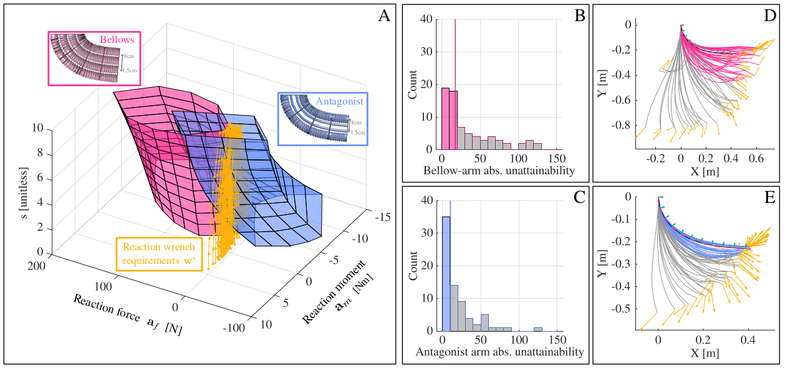

# Attainability Methods Demo

A demonstration of the wrench-hull methods for quickly evaluating a soft robot arm's ability to complete requisite tasks, introduced in Fan, Roulier, and Olson, Robosoft 2025 [1].

This demo will be presented at the 2nd Unconventional Robots workshop at ICRA 2025.

### References
[1] B. Fan, J. Roulier, and G. Olson, “A Fast and Model Based Approach for Evaluating Task-Competence of Antagonistic Continuum Arms,” Apr. 2025. arXiv:2411.00241 version: 3.